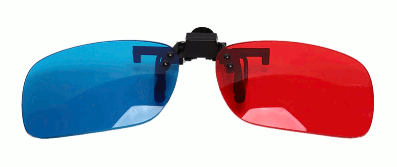

# OpenSCAD with 3D glasses



## Build notes

These are build notes on compiling [OpenSCAD](http://www.openscad.org) to an [AppImage](http://www.appimage.org) on a [raspberry pi 4](https://www.raspberrypi.org) running 2020-08-20-raspios-buster-arm64.

### Install build dependencies

```
sudo apt-get upgrade
sudo apt-get install cmake gawk bison flex gettext itstool libcgal-dev libeigen3-dev libfontconfig1-dev libharfbuzz-dev libopengl-dev libglew-dev libopencsg-dev libxml2-dev libboost-all-dev libzip-dev libcairo2-dev lib3mf-dev libqscintilla2-qt5-dev qtmultimedia5-dev imagemagick libqt5gamepad5-dev libhidapi-dev libspnav-dev libdouble-conversion-dev qt5-default
```
### Download sources

```
git clone http://github.com/koendv/openscad
cd openscad
git submodule update --init
```
### Build openscad
First check all dependencies are installed:

```
source ./scripts/setenv-unibuild.sh
./scripts/check-dependencies.sh
```
Check the output of *check-dependencies* is "OK", then build:
```
mkdir build
cd build
cmake -DCMAKE_INSTALL_PREFIX=/usr ..
make -j4
```
### Create appimage

The AppImage contains the application, and all shared libraries and files needed to run the application. To create the AppImage, use [AppImageKit](https://github.com/AppImage/AppImageKit) and [linuxqtdeploy](https://github.com/probonopd/linuxdeployqt).

Build and install AppImageKit:
```
git clone --recursive https://github.com/AppImage/AppImageKit
mkdir build
cd build/
cmake ..
make
sudo make install
```
Needed by linuxqtdeploy:
```
apt-get install patchelf
```
Get linuxdeployqt:
```
git clone --recursive https://github.com/probonopd/linuxdeployqt
cd linuxdeployqt
```
Patch linuxdeployqt:
```
patch -p1 <<EOD
diff --git a/tools/linuxdeployqt/main.cpp b/tools/linuxdeployqt/main.cpp
index 338a0e2..47f2555 100644
--- a/tools/linuxdeployqt/main.cpp
+++ b/tools/linuxdeployqt/main.cpp
@@ -189,6 +189,7 @@ int main(int argc, char **argv)
     
     // We need to catch those errors at the source of the problem
     // https://github.com/AppImage/appimage.github.io/search?q=GLIBC&unscoped_q=GLIBC&type=Issues
+#if 0
     const char *glcv = gnu_get_libc_version ();
     if(skipGlibcCheck) {
         qInfo() << "WARNING: Not checking glibc on the host system.";
@@ -210,6 +211,7 @@ int main(int argc, char **argv)
             return 1;
         }
     }
+#endif
 
     if (argc < 2 || (firstArgument.startsWith("-"))) {
         qInfo() << "";
EOD
```
Set path to qmake:
```
export PATH=/usr/lib/qt5/bin/:$PATH
```
Build and install linuxdeployqt:
```
qmake
make
sudo make install
```
Create OpenSCAD application AppDir:
```
cd src/openscad/build
export INSTALL_ROOT=$HOME/OpenSCAD-aarch64.AppDir
mkdir $INSTALL_ROOT
make install DESTDIR=$INSTALL_ROOT
```
Create AppImage:
```
linuxdeployqt $HOME/OpenSCAD-aarch64.AppDir/usr/share/applications/openscad.desktop -appimage -no-strip 
```
Test AppImage:
```
./OpenSCAD-aarch64.AppImage
```
Run the AppImage on a clean install of the operating system to check all dependencies have been caught.

### 32-bit version

The 32-bit version for Raspberry Pi OS 2021-03-04-raspios-buster-armhf. It differs in that Qt5, lib3mf and QScintilla have been [compiled from source](https://github.com/koendv/qt5-opengl-raspberrypi). Configuration command line:
```
export QT_SELECT=qt5.15.2-opengl
qmake openscad.pro "PREFIX=/usr" "LIB3MF_INCLUDEPATH=/usr/include/Bindings/Cpp"  "LIB3MF_LIBPATH=-l3mf -lzip -lz"
```

## Editing an AppImage

If you wish to edit, add or remove a file in an existing AppImage, there is no need to recompile. Simply extract the file tree from the AppImage, edit, test and re-package:

```
$ OpenSCAD.AppImage --appimage-extract
$ gedit squashfs-root/usr/share/openscad/color-schemes/render/redcyanglasses.json
$ ./squashfs-root/AppRun
$ appimagetool.AppImage squashfs-root/ OpenSCAD-new.AppImage
```
## Links

- [Rendering 3D Anaglyph in OpenGL](https://quiescentspark.blogspot.com/2011/05/rendering-3d-anaglyph-in-opengl.html) - Geometry calculations used in file ``GLView.cc``, method ``GLView::setup3dCamera()``
- [Calculating Stereo Pairs](http://paulbourke.net/stereographics/stereorender/) - How to render and how not to.
- [Producing Anaglyphs from Synthetic Images](https://citeseerx.ist.psu.edu/viewdoc/download?doi=10.1.1.7.6968&rep=rep1&type=pdf#page=4) -  The coefficients used in file ``colormap.cc``, method ``ColorMap::anaglyphColor()``, are on page 4.
- [Pull Request](https://github.com/openscad/openscad/pull/3693) at openscad. Contribute to the source code.

## Credits
After a patch by Josef Pavlik
