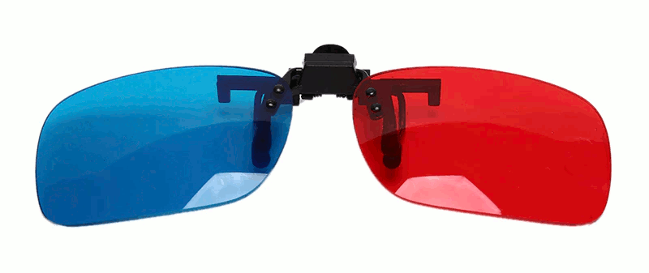
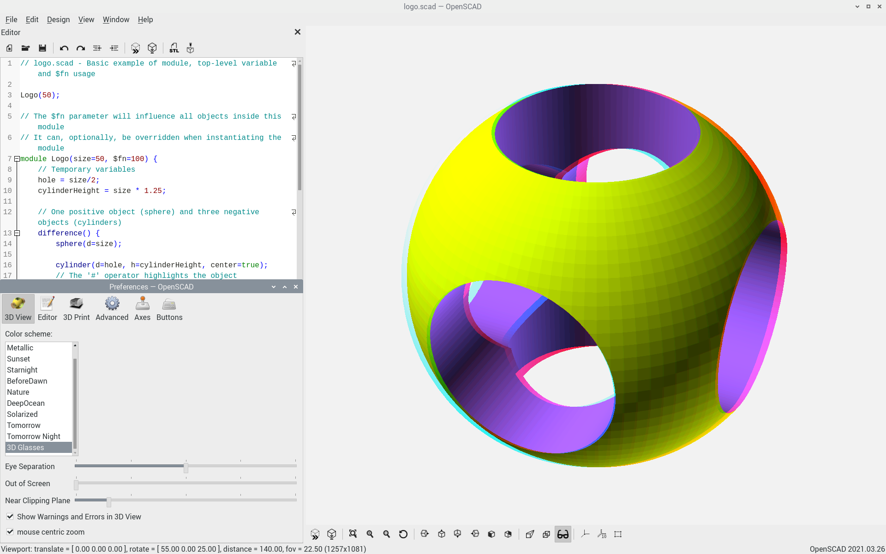
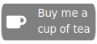
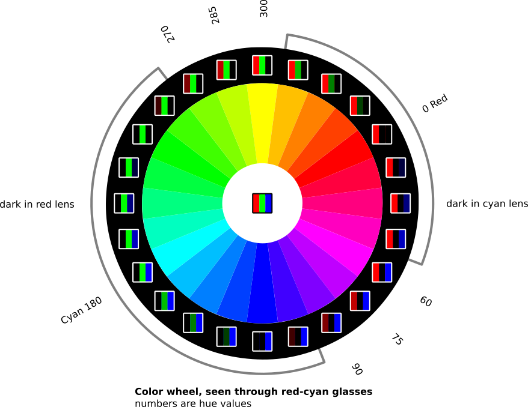

# OpenSCAD w/ 3D



This is the OpenSCAD CAD modeller, compiled for raspberry pi, with support for showing your designs in 3D when viewed with anaglyph 3D glasses. Anaglyph 3D glasses are glasses with red and cyan colored lenses.

I use this to check a design before sending it to a 3D printer. The way I see it, if I spot an error before printing, even only once, these glasses have already paid for themselves.

## Sample screen

[](https://raw.githubusercontent.com/koendv/openscad-raspberrypi/master/images/openscad_screenshot_big.png)

You need red/cyan colored glasses to see the 3D effect.

## Downloads

- [Binary](https://github.com/koendv/openscad-raspberrypi/releases) for raspberry pi.
- [Patch](https://raw.githubusercontent.com/koendv/openscad-raspberrypi/master/anaglyph.patch) and [icon](images/Anaglyph-32.png) for compiling openscad with support for 3D glasses.

If you like this, maybe you want to buy me a cup of tea:

[](https://ko-fi.com/Q5Q03LPDQ)
## Usage

- Start OpenSCAD and load your .scad source file.

- Choose the "3D Glasses" color scheme. From the menu, choose *Edit->Preferences->3D View*.
Select color scheme "3D Glasses".

- Switch axis  off.  The mind rebels if an axis sticks out of the screen, coming straight at you. Also, objects "behind" the screen are easier on the eye than objects that "stick out" from the screen.

- Click the render icon  to render your object.

- Click the 3D glasses icon  to toggle stereo mode.

- Put 3D glasses on.

- Zoom out  until the whole object is visible.

- Press *Ctrl* and rotate the mouse scroll wheel to adjust the eye separation. Too little eye separation and the 3D effect disappears; too much and you get eyestrain. Adjust for your viewing comfort.

- The built-in variable $anaglyph is true when rendering in 3d anaglyph mode, false otherwise.

## Colors

[](https://raw.githubusercontent.com/koendv/openscad-raspberrypi/master/images/colorwheel.svg)

The glasses used to see 3D anaglyphs have red lenses for the left eye, cyan (blue-green) lenses for the right eye. Red (hue 0) and cyan (hue 180) are complementary colours; in opposite positions on the colour wheel.

To see depth, both eyes need to see an image. If an object has pure red or cyan color, the depth illusion will fail. If you look at a color wheel through 3D glasses, blue-green colors appear dark through the red lens; red colors appear dark through the blue-green lens. Colors suitable for anaglyph  are those that can be seen through both lenses. This includes greys, greens (hue around 75) and purple (hue around 285).

If a color has strong green but weak red, the green may be so strong that it persists even after filtering. The left eye then sees a weak image for the right eye, superimposed on the image for the left eye. To lessen this effect, called *ghosting*, saturated colors should be avoided.

Two color schemes are provided. The color scheme "Ash" uses grey colors for the object, and green for the highlight. The color scheme "3D Glasses" uses greens and purples for the object, and grey for the highlight. Because colors are a matter of personal taste, a small [python script](gencolorscheme.py) is included to allow adapting the color scheme.

### References
- [Dubois shading](http://www.site.uottawa.ca/~edubois/anaglyph/) is an algorithm that maps colors in colors suitable for anaglyphs. Programs like [citra](https://citra-emu.org/) and  [bino](https://bino3d.org/) implement a Dubois shader in OpenGL using textures.


## Build notes

These are build notes on compiling [OpenSCAD](http://www.openscad.org) to an [AppImage](http://www.appimage.org) on a [raspberry pi 4](https://www.raspberrypi.org) running 2020-08-20-raspios-buster-arm64.

### Install build dependencies

```
sudo apt-get upgrade
sudo apt-get install cmake gawk bison flex gettext itstool libcgal-dev libeigen3-dev libfontconfig1-dev libharfbuzz-dev libopengl-dev libglew-dev libopencsg-dev libxml2-dev libboost-all-dev libzip-dev libcairo2-dev lib3mf-dev libqscintilla2-qt5-dev qtmultimedia5-dev imagemagick libqt5gamepad5-dev libhidapi-dev libspnav-dev libdouble-conversion-dev qt5-default
```
### Download sources

```
git clone http://github.com/openscad/openscad
cd openscad
git submodule update --init
```
### Patch for 3D anaglyph
Download patch and icon

```
wget https://raw.githubusercontent.com/koendv/openscad-raspberrypi/master/anaglyph.patch
wget https://github.com/koendv/openscad-raspberrypi/raw/master/images/Anaglyph-32.png
patch -p1 < anaglyph.patch
cp Anaglyph-32.png images/
```
### Build openscad
First check all dependencies are installed:

```
source ./scripts/setenv-unibuild.sh
./scripts/check-dependencies.sh
```
Check the output of *check-dependencies* is "OK", then build:
```
qmake openscad.pro "PREFIX=/usr"
make -j4
```
### Create appimage

The AppImage contains the application, and all shared libraries and files needed to run the application.

Copy openSCAD binaries to appimage:
```
export INSTALL_ROOT=$HOME/OpenSCAD-aarch64.AppDir
mkdir $INSTALL_ROOT
make install
```
Copy Qt translations:
```
(cd /; tar cvhf - usr/share/qt5/translations/) | (cd $INSTALL_ROOT; tar xvpf -)
```
Copy openSCAD library dependencies to AppImage.
First make a list of all shared libraries used by openscad, then copy these libraries to the AppImage directory.

```
mkdir $INSTALL_ROOT/usr/lib/
cd $INSTALL_ROOT
LIBS=$(ldd usr/bin/openscad | sed -e 's/^.* => //' -e 's/ (0x.*$//' | grep '/usr/')
for L in $LIBS
do
  cp --preserve $L $INSTALL_ROOT/usr/lib/
done
```
If the app uses any Qt plugins, the plugins would need to be copied too, just like any other shared library.

Copy AppImage files:

From `https://github.com/AppImage/AppImageKit/releases/` download `AppRun-aarch64`.
```
cp ~/Downloads/AppRun-aarch64 $INSTALL_ROOT/AppRun
chmod a+x $INSTALL_ROOT/AppRun
```
Copy desktop shortcut and icon:
```
cd $INSTALL_ROOT
cp usr/share/icons/hicolor/256x256/apps/openscad.png .
cp usr/share/applications/openscad.desktop .
```
Edit openscad.desktop and add X-AppImage-Version version info:
```
[Desktop Entry]
Type=Application
Version=1.0
Name=OpenSCAD
Icon=openscad
Exec=openscad %f
MimeType=application/x-openscad;
Categories=Graphics;3DGraphics;Engineering;
Keywords=3d;solid;geometry;csg;model;stl;
X-AppImage-Version=2021.02.13
```
Create AppStream metadata:
```
cd $INSTALL_ROOT/usr/share/metainfo/
cp org.openscad.OpenSCAD.appdata.xml openscad.appdata.xml
```
From `https://github.com/AppImage/AppImageKit/releases/` download `appimagetool-aarch64.AppImage`. Create AppImage:
```
cd $INSTALL_ROOT/..
appimagetool-aarch64.AppImage $INSTALL_ROOT
```
Test AppImage:
```
./OpenSCAD-aarch64.AppImage
```
Run the AppImage on a clean install of the operating system to check all dependencies have been caught.

### 32-bit version

The 32-bit version for Raspberry Pi OS 2021-01-11-raspios-buster-armhf differs in that Qt5, lib3mf and QScintilla have been [compiled from source](https://github.com/koendv/qt5-opengl-raspberrypi).

## Credits
After a patch by Josef Pavlik
