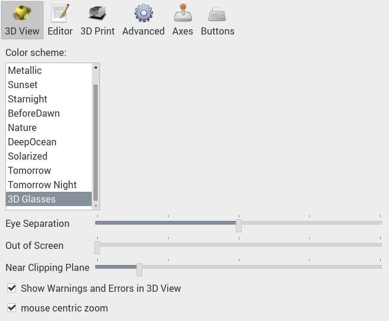

# OpenSCAD with 3D glasses


This is the OpenSCAD CAD modeller, compiled for raspberry pi, with support for showing your designs in 3D when viewed with anaglyph 3D glasses. The anaglyph 3D glasses used are glasses with red and cyan colored lenses.

## Sample screen

[](https://raw.githubusercontent.com/koendv/openscad-raspberrypi/master/images/openscad_screenshot_big.png)

You need red/cyan colored glasses to see the 3D effect. A short, 15 second 3D video made with OpenSCAD (720p):

[](http://www.youtube.com/watch?v=ur4IqVoL11s "3D video for red/cyan glasses")

## Downloads

- [Binaries](https://github.com/koendv/openscad-raspberrypi/releases) for raspberry pi and others.

If you like this, maybe you want to buy me a cup of tea:

[](https://ko-fi.com/Q5Q03LPDQ)
## Usage

A walk-through that shows how to see a model in anaglyph 3D.

- Start OpenSCAD and load your .scad source file. As an example, we will render the OpenSCAD logo. From the menu, choose *File->Examples->Basics->logo.scad*.

- Choose the "3D Glasses" color scheme. From the menu, choose *Edit->Preferences->3D View*.
Select color scheme "3D Glasses".

- Switch axis  off.

- Click the render icon  to render your object. There are two buttons to display your model: preview and render. Preview  renders fast, colors and transparencies are preserved, but rotating the 3D model is somewhat sluggish. Render  renders slower, colors and transparencies are lost, but rotating the model is fluid, and the rendering output can be written to an STL file for 3D printing.

- Reset view  and zoom out  so the whole object is visible.

- Put 3D glasses on.

- Click the 3D glasses icon  to toggle stereo mode.

## Preferences

[](https://raw.githubusercontent.com/koendv/openscad-raspberrypi/master/images/preferences.png)

The preference panel is accessed using the menu *Edit->Preferences->3D View*. The preferences panel has four settings for anaglyphs: color scheme, eye separation, out of screen, and near clipping plane.

- *color scheme* A good color scheme for anaglyphs is "3D Glasses".
- *eye separation* The *eye separation* slider sets the horizontal distance between the left and right cameras, similar to the horizontal distance between left and right eye. Too little eye separation and the 3D effect disappears; too much and you get eyestrain. The optimum value depends upon screen size. Adjust for your viewing comfort.
- *out of screen* Objects that appear behind the screen are easier on the eye than objects that appear to stick out from the screen. With the *out of screen* slider you can push the objects back, behind the screen. Adjust for your viewing comfort.
- *near clipping plane* The *near clipping plane* slider allows you to set the closest object you still want to see. To calibrate, slide *near clipping plane* completely to the left. Switch axis on, and turn the object so the axis points straight at you. Move the *near clipping plane* slider to the right. Notice how the axis pointing at you becomes shorter. Adjust until comfortable. Do not set *near clipping plane* too much to the right, or the complete model will disappear.

If the sliders for eye separation, out of screen, and near clipping distance are completely to the left, anaglyph is switched off and the 3D display behaves more or less like a normal 2D display.

The *near clipping plane* setting can also be used to see inside a 3D model. As an example, we will look inside the OpenSCAD logo. From the menu, choose *File->Examples->Basics->logo.scad*, reset view , zoom out  render  and set 3D anaglyph mode . Open the preferences panel *Edit->Preferences->3D View* and slide the *near clipping plane* setting to the middle. Observe how the logo is sliced in half and you can see inside the 3D model.

Not all colors work well with anaglyphs. First we discuss which colors are suitable, then list the measures taken to ensure all colors used are suitable for anaglyphs.

## Colors suitable for anaglyph 3D

[](https://raw.githubusercontent.com/koendv/openscad-raspberrypi/master/images/wheel.png)

This color wheel shows all colors of the rainbow. The numbers are the color [hue](https://en.wikipedia.org/wiki/HSL_and_HSV), a number from 0 to 360.

The glasses used to see 3D anaglyphs have red lenses for the left eye, and cyan (blue-green) lenses for the right eye. Red (hue 0) and cyan (hue 180) are complementary colours. Complementary colours are in opposite positions on the colour wheel.

To see depth, both eyes need to see an image. If you look at a color wheel through 3D glasses, blue-green colors appear dark through the red lens; red colors appear dark through the cyan lens. If an object has pure red or cyan color, the depth illusion will fail because only one eye gets an image. Colors most suitable for anaglyph are a mix of red and cyan; this way both left and right eye see an image. These colors include grey, green and purple. To some degree colors are subjective, and what colors to use is dependent upon the combination of display and 3D glasses used.

Apart from hue, saturation also plays a role. The cyan lens dampens green and lets red pass through. However, if a color has strong green but weak red after filtering through the cyan lens, green and red may be more or less the same strength. The eye then sees two images superimposed. This is called *ghosting*. Less saturated colors have less *ghosting*.

To choose the correct colors, two solutions: a color scheme that uses greens, purple and grey, and Dubois shading.

## Color Scheme

A color scheme for red/cyan anaglyphs on lcd displays is provided. The color scheme "3D Glasses" uses green, purple and grey. Because colors are a matter of personal taste, a small [python script](gencolorscheme.py) is included to allow adapting the color scheme.

The ideal color scheme depends upon display and glasses used. As an example, if you wanted to print anaglyphs, you might want to print a color wheel and look at the printed color wheel, once through the left lens, and once through the right lens, and this way choose the colors to use.

Anaglyphs have an orientation. The 3D effect is lost if you turn your head 90 degrees, or, for a printed anaglyph, if you turn the paper 90 degrees.

## Dubois shading


[Dubois shading](http://www.site.uottawa.ca/~edubois/anaglyph/) is an algorithm that replaces all colors with the closest color suitable for anaglyphs. The picture above shows on the inside a color wheel, and on the outside what the same colors look like after Dubois shading. Notice how red and cyan change. Also, after applying Dubois, colors are less saturated, more "washed out".

Usually, the Dubois algorithm is applied to the pixels after rendering. Here, the Dubois algorithm is applied to the color scheme before rendering.

The color scheme is updated automatically when changing to or from 3D view. Clicking preview to update the colors is only necessary if the OpenSCAD script contains *color()* instructions.

## Links
- [Choose a good screen - glasses pair](http://www.david-romeuf.fr/3D/Anaglyphes/BonCoupleEL/GoodCoupleMonitorGlassesAnaglyph.html)
- [Pull Request](https://github.com/openscad/openscad/pull/3693) at openscad

## Build notes

These are build notes on compiling [OpenSCAD](http://www.openscad.org) to an [AppImage](http://www.appimage.org) on a [raspberry pi 4](https://www.raspberrypi.org) running 2020-08-20-raspios-buster-arm64.

### Install build dependencies

```
sudo apt-get upgrade
sudo apt-get install cmake gawk bison flex gettext itstool libcgal-dev libeigen3-dev libfontconfig1-dev libharfbuzz-dev libopengl-dev libglew-dev libopencsg-dev libxml2-dev libboost-all-dev libzip-dev libcairo2-dev lib3mf-dev libqscintilla2-qt5-dev qtmultimedia5-dev imagemagick libqt5gamepad5-dev libhidapi-dev libspnav-dev libdouble-conversion-dev qt5-default
```
### Download sources

```
git clone http://github.com/koendv/openscad
cd openscad
git submodule update --init
```
### Build openscad
First check all dependencies are installed:

```
source ./scripts/setenv-unibuild.sh
./scripts/check-dependencies.sh
```
Check the output of *check-dependencies* is "OK", then build:
```
mkdir build
cd build
cmake -DCMAKE_INSTALL_PREFIX=/usr ..
make -j4
```
### Create appimage

The AppImage contains the application, and all shared libraries and files needed to run the application.

Copy openSCAD binaries to appimage:
```
export INSTALL_ROOT=$HOME/OpenSCAD-aarch64.AppDir
mkdir $INSTALL_ROOT
make install DESTDIR=$INSTALL_ROOT
```
Copy Qt translations:
```
(cd /; tar cvhf - usr/share/qt5/translations/) | (cd $INSTALL_ROOT; tar xvpf -)
```
Copy openSCAD library dependencies to AppImage.
First make a list of all shared libraries used by openscad, then copy these libraries to the AppImage directory.

```
mkdir $INSTALL_ROOT/usr/lib/
cd $INSTALL_ROOT
LIBS=$(ldd usr/bin/openscad | sed -e 's/^.* => //' -e 's/ (0x.*$//' | grep '/usr/')
for L in $LIBS
do
  cp --preserve $L $INSTALL_ROOT/usr/lib/
done
```
If the app uses any Qt plugins, the plugins would need to be copied too, just like any other shared library.

Copy AppImage files:

From `https://github.com/AppImage/AppImageKit/releases/` download `AppRun-aarch64`.
```
cp ~/Downloads/AppRun-aarch64 $INSTALL_ROOT/AppRun
chmod a+x $INSTALL_ROOT/AppRun
```
Copy desktop shortcut and icon:
```
cd $INSTALL_ROOT
cp usr/share/icons/hicolor/256x256/apps/openscad.png .
cp usr/share/applications/openscad.desktop .
```
Edit openscad.desktop and add X-AppImage-Version version info:
```
[Desktop Entry]
Type=Application
Version=1.0
Name=OpenSCAD
Icon=openscad
Exec=openscad %f
MimeType=application/x-openscad;
Categories=Graphics;3DGraphics;Engineering;
Keywords=3d;solid;geometry;csg;model;stl;
X-AppImage-Version=2021.02.25
```
Create AppStream metadata:
```
cd $INSTALL_ROOT/usr/share/metainfo/
cp org.openscad.OpenSCAD.appdata.xml openscad.appdata.xml
```
From `https://github.com/AppImage/AppImageKit/releases/` download `appimagetool-aarch64.AppImage`. Create AppImage:
```
cd $INSTALL_ROOT/..
appimagetool-aarch64.AppImage $INSTALL_ROOT
```
Test AppImage:
```
./OpenSCAD-aarch64.AppImage
```
Run the AppImage on a clean install of the operating system to check all dependencies have been caught.

### 32-bit version

The 32-bit version for Raspberry Pi OS 2021-01-11-raspios-buster-armhf differs in that Qt5, lib3mf and QScintilla have been [compiled from source](https://github.com/koendv/qt5-opengl-raspberrypi). Configuration command line:
```
export QT_SELECT=qt5.15.2-opengl
qmake openscad.pro "PREFIX=/usr" "LIB3MF_INCLUDEPATH=/usr/include/Bindings/Cpp"  "LIB3MF_LIBPATH=-l3mf -lzip -lz"
```
or. if using cmake,
```
cmake -DCMAKE_INSTALL_PREFIX:PATH=/usr -DLIB3MF_INCLUDE_DIRS=/usr/include/Bindings/Cpp "-DLIB3MF_LIBRARIES=-l3mf -lzip -lz" ..
```

## Credits
After a patch by Josef Pavlik
