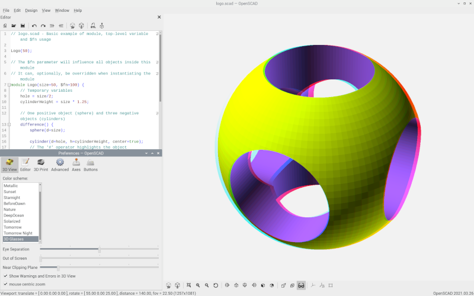
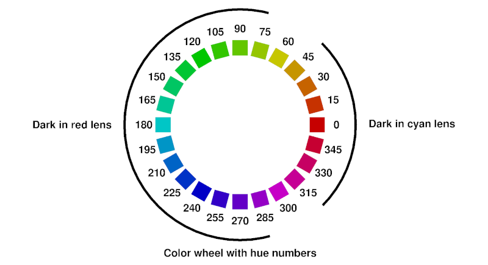

# OpenSCAD with 3D glasses

This is the [OpenSCAD](http://www.openscad.org/) CAD modeller, with support for showing your designs in 3D when viewed with anaglyph 3D glasses. The anaglyph 3D glasses used are glasses with red and cyan colored lenses. [Binaries](https://github.com/koendv/openscad-raspberrypi/releases) for raspberry pi, linux, windows, and macosx.

## Sample screen

You need red/cyan colored glasses to see the 3D effect. A short, 15 second 3D video made with OpenSCAD (720p):

## Downloads

- [Binaries](https://github.com/koendv/openscad-raspberrypi/releases) for raspberry pi, linux, windows, and macosx.

If you like this, maybe you want to buy me a cup of tea:

## Usage

A walk-through that shows how to see a model in anaglyph 3D.

- Start OpenSCAD and load your .scad source file. As an example, we will render the OpenSCAD logo. From the menu, choose *File->Examples->Basics->logo.scad*.

- Choose the "3D Glasses" color scheme. From the menu, choose *Edit->Preferences->3D View*.
Select color scheme "3D Glasses".

- Switch axis  off.

- Click the 3D glasses icon  to toggle stereo mode.

- Put 3D glasses on.

- Click the render icon  to render your object. There are two buttons to display your model: preview and render. Preview  renders fast, colors and transparencies are preserved, but rotating the 3D model is somewhat sluggish. Render  renders slower, colors and transparencies are lost, but rotating the model is fluid, and the rendering output can be written to an STL file for 3D printing.

- Reset view  and zoom out  so the whole object is visible. This produces the sphere from the sample screen above.

- Place the mouse above the render window, and drag the mouse with the left mouse button pushed down to rotate the view.

## Preferences

The preference panel is accessed using the menu *Edit->Preferences->3D View*. The preferences panel has four settings for anaglyphs: color scheme, eye separation, out of screen, and near clipping plane.

- *color scheme* A good color scheme for anaglyphs is "3D Glasses".
- *eye separation* The *eye separation* slider sets the horizontal distance between the left and right cameras, similar to the horizontal distance between left and right eye. Too little eye separation and the 3D effect disappears; too much and you get eyestrain. As an initial setting, put the slider halfway, in the middle.
- *out of screen* Objects that appear behind the screen are easier on the eye than objects that appear to stick out from the screen. With the *out of screen* slider you can push the objects back, behind the screen. Adjust for your viewing comfort.
- *near clipping plane* The *near clipping plane* slider allows you to set the closest object you still want to see. To calibrate, slide *near clipping plane* completely to the left. Switch axis on, and turn the object so the axis points straight at you. Move the *near clipping plane* slider to the right. Notice how the axis pointing at you becomes shorter. Adjust until comfortable. Do not set *near clipping plane* too much to the right, or the complete model will disappear.

If the sliders for eye separation, out of screen, and near clipping distance are completely to the left, anaglyph is switched off and the 3D display behaves more or less like a normal 2D display.

Standard anaglyph glasses have the blue lens for the right eye, red lens for the left eye. In an anaglyph, objects are drawn twice: once in red, once in blue. If the blue image is to the right of the red image, the object appears to be in front of the screen. If the blue image is to the left of the red image, the object appears to be behind the screen. If red and blue outline coincide, the object appears to be located at the screen itself. If you want to locate an object *exactly* at the screen, take a look without 3D glasses and set the *out of screen* slider so blue and red image of the object coincide.

The *near clipping plane* setting can also be used to see inside a 3D model. As an example, we will look inside the OpenSCAD logo:

- From the menu, choose *File->Examples->Basics->logo.scad*
- reset view 
- zoom out 
- render 
- set 3D anaglyph mode 
- Open the preferences panel *Edit->Preferences->3D View* and slide the *near clipping plane* setting to the middle. Observe how the logo is sliced in half and you can see inside the 3D model.

Anaglyphs have an orientation. The 3D effect is lost if you turn your head 90 degrees, or, for a printed anaglyph, if you turn the paper 90 degrees.

## Window violations

There's a very simple rule: What is in front hides what is behind. In a [window violation](https://en.wikipedia.org/wiki/Stereoscopy#Stereo_window), what is behind seems to hide what is in front.

Imagine a sphere floating in front of the window. The sphere is moving horizontally, to the window border. When the sphere crosses the window border, there is a contradiction:

- the window border is at the screen.
- the sphere is in front of the screen.
- so when the sphere crosses the window border, you would expect the sphere to hide the window border
- instead it is the window border that hides the sphere

This is called a window violation. A window violation causes visual discomfort. To avoid window violations, *if something sticks out of the screen, it should not overlap the window border*.

As a quick fix, either

- Zoom out  until all objects are inside the window, or
- Move the *Out of Screen* slider to the right until all objects are behind the screen

## Color Scheme

A color scheme "3D Glasses" for red/cyan 3D anaglyphs is provided. However, as the anaglyph 3d effect depends upon the combination of display and glasses used, a single color scheme may not fit all.

3D glasses. From top to bottom:
 [stereoeye](https://stereoeye.jp/shop_e/index.html), [acb3d](http://www.acb3d.com/acbviewers.html), [noname](https://www.aliexpress.com/item/4000683023634.html), [Reel3D No. 7020 copy](https://www.aliexpress.com/item/32999369805.html). 
Note the variation in color, especially in cyan.

If you wish to tune the color scheme for your display and 3D glasses run the [``colorscheme.scad``](scripts/colorscheme.scad) OpenSCAD script through the customizer. Select color values using the slider. Switch between perspective and 3D anaglyph mode to see what the colors look like. The chosen color scheme is printed on the OpenSCAD console window. Copy and paste the color scheme to the file ``redcyanglasses.json`` and restart.

This ends the practical guide.
Below an explanation of the algorithms used.

## Colors suitable for anaglyph 3D

Not all colors work well with anaglyphs. First we discuss which colors are suitable, then list the measures taken to ensure all colors used are suitable for anaglyphs.

This color wheel shows all colors of the rainbow. The numbers are the color [hue](https://en.wikipedia.org/wiki/HSL_and_HSV), a number from 0 to 360.

The glasses used to see 3D anaglyphs have red lenses for the left eye, and cyan (blue-green) lenses for the right eye. Red (hue 0) and cyan (hue 180) are complementary colors. Complementary colors are in opposite positions on the color wheel.

To see depth, both eyes need to see an image. If you look at a color wheel through 3D glasses, blue-green colors appear dark through the red lens; red colors appear dark through the cyan lens. If an object has pure red or cyan color, the depth illusion will fail because only one eye gets an image.

Colors most suitable for anaglyph are a mix of red and cyan; this way both left and right eye see an image. These colors include gray, green-yellow and purple. To some degree colors are subjective, and what colors to use is dependent upon the combination of display and 3D glasses used.

Apart from hue, saturation also plays a role. The cyan lens dampens green and lets red pass through. However, if a color has strong green but weak red, then after filtering through the cyan lens, green and red may be more or less the same strength. The eye then sees two images superimposed. This is called *ghosting*. Less saturated colors have less *ghosting*.

In general, if the images of left and right eye are exactly the same, no depth is perceived. If the difference between the images of left and right eye consists of small, horizontal translations, you perceive depth. If the difference between the images of left and right eye is too big, stereo vision fails ([retinal rivalry](https://en.wikipedia.org/wiki/Binocular_rivalry)).

To choose the correct colors, two solutions: a color scheme that uses green yellow, purple and gray, and Dubois shading.

## Dubois shading

[Dubois shading](http://www.site.uottawa.ca/~edubois/anaglyph/) is an algorithm that replaces all colors with the closest color suitable for anaglyphs. The picture above shows on the inside a color wheel, and on the outside what the same colors look like after Dubois shading.

One of the reasons Dubois shading is popular is that Dubois shading is a matrix multiplication in the RGB domain; something easily implemented in a GPU as an OpenGL shader. The coefficients used in the matrix multiplication are not universal but depend upon display and 3D glasses. The coefficients used in OpenSCAD are for LCD and common commercial red/cyan glasses.

### Hue in Dubois shading

This is a graph of color hue after Dubois shading in function of color hue before Dubois shading. In this graph, Dubois shading was applied to the colors of the color wheel. The x axis is the color hue before Dubois, the y axis the color hue after Dubois. In purple actual values, in green a stylized model.

Note the colors with hue 75 and 255 remain unchanged, while colors with hue 165 and 345 show the biggest changes.

Dubois shading maps half of the color wheel to hues around 75, greenish yellow, and maps the other half of the color wheel to hues around 255, blue-purple. Green-yellow and blue-purple are the colors which can be seen through both red lens and cyan lens.

From the stylized model one sees that

- hues from 75-90 to 75+90 are mapped to 75-16.75 to 75+16.75
- hues from 255-90 to 255+90 are mapped to 255-16.75 to 255+16.75

One could characterize an implementation of Dubois shading by central color (here: 75 degree) and bandwidth (here: 33.5) or slope (here: 33.5/180).

All in all, Dubois shading is quite nifty for a single matrix multiplication.

Usually, the Dubois algorithm is applied to the pixels after rendering. In the OpenSCAD implementation, the Dubois algorithm is applied to the color scheme before rendering. This reduces the number of calculations.

The color scheme is updated automatically when changing to or from 3D view. Clicking preview to update the colors is only necessary if the OpenSCAD script contains *color()* instructions.

## Characterizing 3D glasses

The lenses of red/cyan 3D glasses are filters. How does one measure the filter characteristics?

Look at this [image](images/transmission_function.png) through the red lens. For each column, mark the lowest row you can still see. This gives you the transmission function of the red lens. Repeat for the cyan lens.

If you want an educated guess: find a Roscolux filter that is similar and use the published transmission function of that filter.

A simpler test is shining a red laser pointer through the cyan lens. If no light shines through, the cyan filter is pretty much ok.

## Developers

Build notes are in [README-DEVELOPER.md](README-DEVELOPER.md)

## Links

- [Choose a good screen - glasses pair](http://www.david-romeuf.fr/3D/Anaglyphes/BonCoupleEL/GoodCoupleMonitorGlassesAnaglyph.html)

## Credits
After a patch by Josef Pavlik
